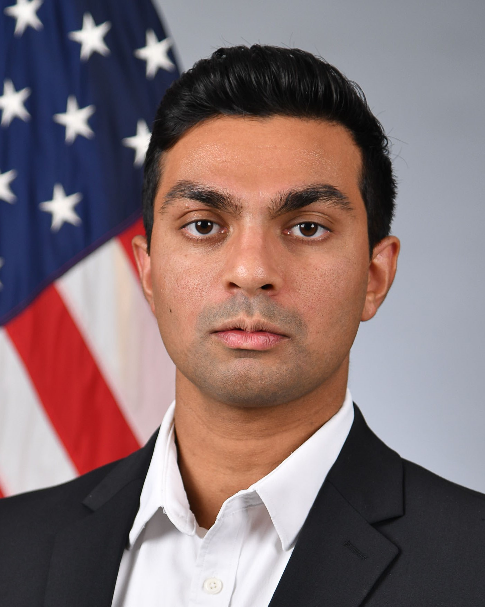
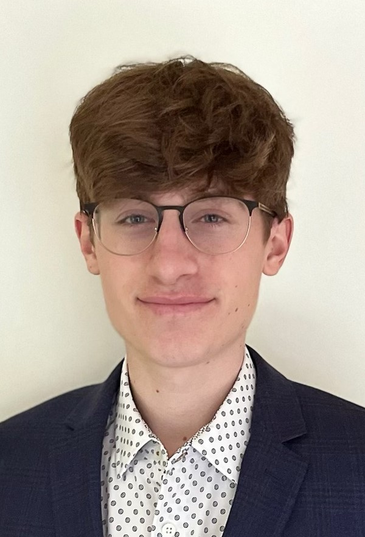
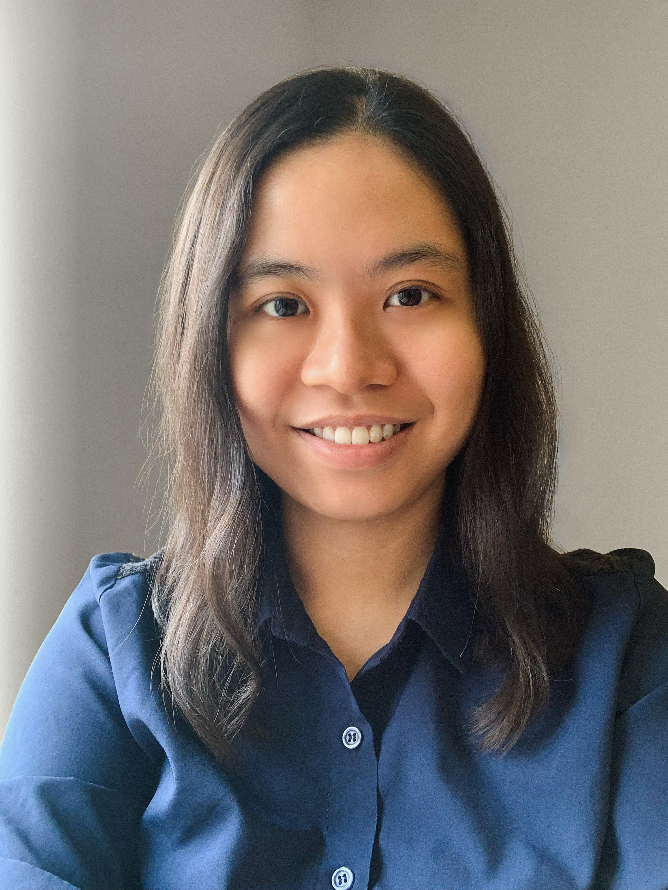

## Openings and prospective students 

Students aspiring for a PhD degree, who have experience and interests in scientific programming and want to work 
at the intersection of mechanics, applied physics and mathematics, please [email](mailto:sidgs@iastate.edu) me.

Our lab provides opportunities to develop skills in high performance computing, numerical methods for computational physics,
big data analysis, scientific machine learning and optimization. 

We collaborate with researchers across academia, national labs and industry, which provides
several opportunities for internships and exciting future career prospects in R&D.

We are always looking for interested and motivated students for PhD. So, please reach out for available positions. 
<!-- We currently have openings for interested graduate and undergraduate students.  
Please see our [Recruitment Flyer](../files/flyer.pdf). -->

## Students

  | **Partth Laad**   PhD (23-)    DoD NDSEG Fellow    UG Rutgers |  | **Benjamin Turner**    MS/PhD (24-)    UG Iowa State     

<!-- ## Undergraduate students
  | **Cai Min Lim**   MS (23-)   UG UT Malaysia     |
  | **John Hilker**   BS   CoE Boeing Research Fellow   UG Iowa State 

  | Placeholder  |  | Placeholder  -->

## Students advised

### At Iowa State

Lim, C M  | MS | Bayesian parameter estimation for reactive flow PDEs   | Year | 2023-25
Vasconcellos, L  | UG | Optimal transport based grid adaptation  | Year | 2024-25
Hilker, J  | UG | Supersonic in-draft wind tunnel  | Year | 2023-24
Skamser, W | UG | Parallel Eigenvalue Computations | Fall | 2023  

### At LANL 

Brackbill, A |  Oregon State | Nuclear Engg. | Summer| 2019
Somers, A |  Penn State  | Nuclear Engg. | Summer | 2020
Holguin, F  | Michigan  | Astronomy | Summer |2020
Molnar, J | Penn State | Mech. Engg. |  Summer |2022
Nidhan, S| UC San Diego | Mech. & Aerosp. Engg. |  Spring| 2022

<!-- 
{: .grad_table } -->

