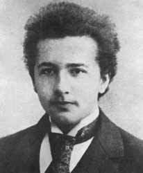

## Openings and prospective students 

Students aspiring for a PhD degree, who have experience and interests in scientific programming and want to work 
at the intersection of mechanics, applied physics and mathematics, please [email](mailto:sidgs@iastate.edu) me.

Our lab provides opportunities to develop skills in high performance computing, numerical methods for computational physics,
big data analysis, scientific machine learning and optimization. 

We collaborate across academia and national labs, which provides
several opportunities for internships and exciting future career prospects in R&D.

We currently have openings for interested graduate and undergraduate students.  
Please see our [Recruitment Flyer](../files/cv.pdf).

## Graduate Students

We are looking to expand!

  | Placeholder  |  | Placeholder 

## Undergraduate students

  | Placeholder  |  | Placeholder 

<!-- 
{: .grad_table } -->

