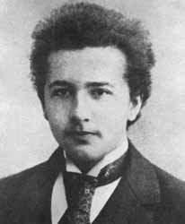

## Openings and prospective students 

Students aspiring for a PhD degree, who have experience and interests in scientific programming and want to work 
at the intersection of mechanics, applied physics and mathematics, please [email](mailto:sidgs@iastate.edu) me.

Our lab provides opportunities to develop skills in high performance computing, numerical methods for computational physics,
big data analysis, scientific machine learning and optimization. 

We collaborate with researchers across academia, national labs and industry, which provides
several opportunities for internships and exciting future career prospects in R&D.

We currently have openings for interested graduate and undergraduate students.  
Please see our [Recruitment Flyer](../files/flyer.pdf).

## Graduate Students

We are looking to expand!

  | Placeholder  |  | Placeholder 

## Undergraduate students

  | Placeholder  |  | Placeholder 

## Students advised

### At Iowa State
William Skamser | Fall 23| Dynetics  

### At LANL 

Anneli Brackbill |  Oregon State | Nuclear Engg. | Summer| 2019
Alex Somers |  Penn State  | Nuclear Engg. | Summer | 2020
Francisco Holguin  | Michigan  | Astronomy | Summer |2020
Joseph Molnar | Penn State | Mech. Engg. |  Summer |2022
Sheel Nidhan| UC San Diego | Mech. & Aerosp. Engg. |  Spring| 2022

<!-- 
{: .grad_table } -->

